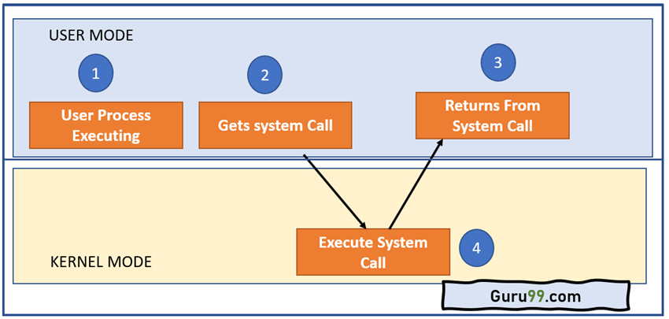
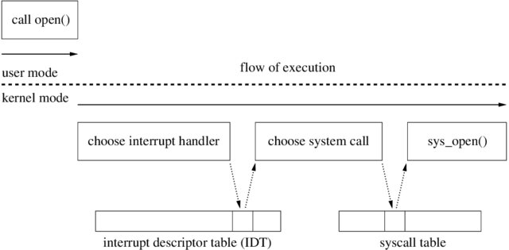

# Discussion 02


## What is a system call?



**Limited direct execution:**
hardware supports different privilege levels. 
- User processes run in user mode (restricted).
    - So that one process cannot create problems for other processes.
        e.g., by running forever, changing other process's data etc.
- OS runs in kernel mode (high privilege).

When a user process needs to perform some high privilege actions, 
    such as reading or writing files, it requests OS to do it through 
    system calls.

During a system call, the running process will yield the CPU to kernel 
    to fulfill the request. 

`getpid()`, `read()`, `write()`, `open()`, `fork()` are some of the system calls.

In assignment 02, you will learn to add a system call to xv6.


## Details of a system call



A process makes a system call through trapping the kernel through a interrupt. 

An interrupt is a hardware or software signal that demands instant attention by an OS. 
It notifies the processor that a critical process needs urgent execution. 
In such a case, the present working process is interrupted. 


## `xv6` Intro

* xv6 available in:           
    `~cs537-1/xv6/`

* To copy and extract xv6 into current directory:    
    $ `tar -xzf ~cs537-1/xv6/xv6.tar.gz -C .`

    ```
    -------------------------------------------------
    include/
    -------------------------------------------------
    fcntl.h   param.h   syscall.h types.h
    fs.h      stat.h    traps.h   x86.h
    -------------------------------------------------
    tools/
    -------------------------------------------------
    dot-bochsrc gdbutil     mkfs.c
    dot-gdbinit makefile.mk
    -------------------------------------------------
    kernel/
    -------------------------------------------------
    asm.h       file.h      mp.c        syscall.c
    bio.c       fs.c        mp.h        sysfile.c
    bootasm.S   ide.c       multiboot.S sysfunc.h
    bootmain.c  initcode.S  picirq.c    sysproc.c
    bootother.S ioapic.c    pipe.c      timer.c
    buf.h       kalloc.c    proc.c      trap.c
    console.c   kbd.c       proc.h      trapasm.S
    data.S      kbd.h       sign.pl     uart.c
    defs.h      lapic.c     spinlock.c  vectors.pl
    elf.h       main.c      spinlock.h  vm.c
    exec.c      makefile.mk string.c
    file.c      mmu.h       swtch.S
    -------------------------------------------------
    user/
    -------------------------------------------------
    cat.c       ln.c        sh.c        usertests.c
    echo.c      ls.c        stressfs.c  usys.S
    forktest.c  makefile.mk tester.c    wc.c
    grep.c      mkdir.c     ulib.c      zombie.c
    init.c      printf.c    umalloc.c
    kill.c      rm.c        user.h
    -------------------------------------------------
    ```

* To run xv6, change directory to inside xv6/, and then run
    $ `make qemu-nox`

* Try the following commands inside qemu

    $ `ls`

    $ `cat README`

    $ `mkdir test`

    $ `echo hello world`

* To quit qemu, press `CTRL + a` then `x`

* See that lots of temporary file created. clean them by running
    $ `make clean`

* `user.h`: contains the system calls available to user
* `Makefile`: `UPROGS` contains the list of user programs

* To create a user-mode program `helloworld` that prints "hello world"
    - create a file `helloworld.c`
        ```c
        // The include files order is important
        #include "types.h"  // needed for uint in user.h
        #include "user.h"   // needed for printf and exit
        int
        main(int argc, char *argv[])
        {
            // 1 - std output [file descriptor]
            // 2 - std error
            printf(1, "Hello world!\n"); 
            exit();         // You must exit. Try commenting it out.
        }
        ```
        - xv6 does not have all the standard library functions you may be used to. it contains a more limited set.
    - Add the name of your program to `UPROGS` in the Makefile. 

* You may want to write some new user-level programs to help test your implementation of `getlastcat`.

* `CPUS := 1` helps debugging during concurrency assignment


## xv6 - tracing a system call: `getpid()`

tracing `getpid()` will give us the idea of how to add a system call in xv6.

* use `getpid()` in `helloworld.c` and check its output.

* the following cmd helps to trace all places where getpid was used.
    - $ `grep -r getpid .`

    should return sth like the following
    ```
        ./sysproc.c:sys_getpid(void)
        ./usys.S:SYSCALL(getpid)
        ./syscall.c:extern int sys_getpid(void);
        ./syscall.c:[SYS_getpid]  sys_getpid,
        ./user.h:int getpid(void);
        ./syscall.h:#define SYS_getpid 11
        ./usertests.c:  ppid = getpid();                    
        ./usertests.c:    ppid = getpid();                  
        ./helloworld.c:  printf(1, "pid: %d\n", getpid());  
    ```
    - `-i` case-insensitive `-v` invert `-w` whole word `-e` pattern, `-n` line number

* first, let's look at `syscall.c`
    ```c
    ./syscall.c:extern int sys_getpid(void);
    ./syscall.c:[SYS_getpid]  sys_getpid,
    ```
    - in the system side, any system call is known as `sys_<system call name>`, 
        e.g. `sys_getpid`

    - you can pass parameter to a system call in the user side, but you won't 
        get it as a argument in the kernel side; 
        e.g., trace `open()`, `kill()` etc. system calls.
        you need to use `argptr`, `argint` etc. to read the arguments in the kernel side.
        maintaining order.
    
    - show `cprintf`

    - the original system calls can be implemented in many different places, 
        as long as they are included correctly. 
        e.g. `getpid()` (related to processes) has been implemented in `sysproc.c`,
        `open()`, `read()`, `write()` (related to files) has been implemented in `sysfile.c`

        However, **Be careful not to implement it in the user side.**

    - to get started with the assignment, first try to reimplement `getpid()`
        as `mygetpid()` and try accessing from a user program.

    - Good to look at `struct proc` too.


## xv6 - essential components of the system call

The two mechanisms involved in executing a system call are trap and 
    return-from-trap.

Now, let's trace trapping into kernel.

1) Trap into the kernel through interrupt `usys.S`

    ```assembly    
    #define SYSCALL(name) \
    .globl name; \
    name: \
        movl $SYS_ ## name, %eax; \     # the syscall number is stored in eax
        int $T_SYSCALL; \               # trap into the kernel
        ret
    ```

    `int $T_SYSCALL`: generates a software interrupt, triggering a system call. The specific interrupt number is often represented by `$T_SYSCALL`.

    `SYSCALL(getpid)` will get replaced by

    ```assembly
    .globl getpid; 
    getpid: 
        movl $SYS_getpid, %eax;      # the syscall number is stored in eax
        int $T_SYSCALL;              # trap into the kernel
        ret
    ```

2) Jump into the trap routine stored in trap vectors / interrupt descriptor table. 

    Trap vectors/ interrupt descriptor table are set up in `vectors.S`. This file do not exist initially, is generated by generated by `vectors.pl`.
    ```c
    // trap.c:13
    extern uint vectors[];  // in vectors.S: array of 256 entry pointers
    // trap.c:24:tvinit()
    SETGATE(idt[T_SYSCALL], 1, SEG_KCODE<<3, vectors[T_SYSCALL], DPL_USER);
    ```
    ```c
    // trap.h
    #define T_SYSCALL       64      // system call
    ```
    Each trap vector calls `alltraps`.

    ```assembly   
    # vectors.S 
    .globl alltraps
    .globl vector0
    vector0:
        pushl $0
        pushl $0
        jmp alltraps
    ...
    .globl vector64
    vector64:
        pushl $0
        pushl $64
        jmp alltraps
    ```

    $ `grep -r alltraps .` reveals 

    ```
    ./trapasm.S:.globl alltraps
    ```

3) Context switch (`trapasm.S`)

    ```assembly
    # Call trap(tf), where tf=%esp
    pushl %esp
    call trap
    addl $4, %esp
    ```
    Here, we save the context of the user process and call `trap()`.
    This `trap(tf)` function is inside `trap.c` file. 

    Notice the function `trapret` too.
    It switches back the context from kernel to user process, and returns to the 
    user mode by calling `iret`
    

4) Call `trap()` (`trap.c`)
    
    ```c
    if(tf->trapno == T_SYSCALL){ // remember T_SYSCALL was passed while interrupt
        ...
        myproc()->tf = tf;
        syscall();
        ...
        return;
    }
    ```
    It calls `syscall()` in the file `syscall.c`;

    When you interrupt/trap into the kernel, you get a `trapno`. If this no. is eql to the global varialbe `T_SYSCALL`, that means user program is requesting a system call. 
    There are other cases where you might trap into the kernel, not needed for now.

5) Call `syscall()` (`syscall.c`)
    
    ```c
    num = curproc->tf->eax; // remember, movl $SYS_getpid, %eax; in usys.S
    if(num > 0 && num < NELEM(syscalls) && syscalls[num]) {
        curproc->tf->eax = syscalls[num](); // system call is happening in this line, 
                                            // the return value is stored in `eax` register.
    }
    ```
    It reads the syscall number from `eax` and calls the corresponding function 
    `syscalls[num]`.

    ```c
    // syscall.c:92
    extern int sys_getpid(void);
    // syscall.c:107
    static int (*syscalls[])(void) = {
    [SYS_fork]    sys_fork,
    [SYS_exit]    sys_exit,
    ...
    [SYS_getpid]  sys_getpid,
    ...
    };
    ```
    `syscalls` is an array of function ptrs, it helps point the function corresponding 
    to the syscall number, for example, `sys_getpid()`. 

6)  After `sys_getpid()` returns, it falls through to `trapret` in `trapasm.S`
        
    Here, context switch happens again and execution returns back to user mode through `iret`.
    (TODO: how)


## Details of a system call [continued]

    
On boot, the OS must set up 
- the trap vectors, 
- syscall interrupt number, and 
- syscall tables. 


## GDB

look at the `Makefile`    
- change `CFlags` from `O2` to `Og`  # helps debugging

$ `echo "set auto-load safe-path /" >> ~/.gdbinit`

$ `make qemu-nox-gdb`

split the terminal and run (show `tmux`)
$ `gdb`

in another terminal
$ `continue`

`CTRL + C`

$ `break main`

\$ `frame` or \$ `list`

$ break trap


